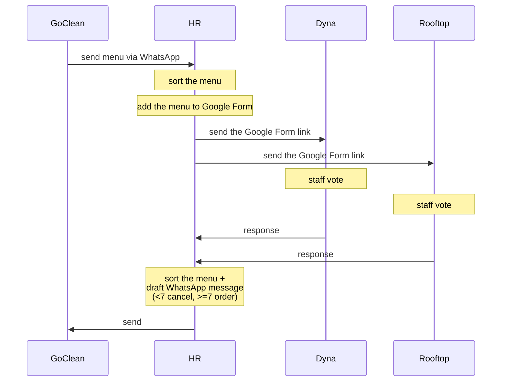

# RooftopIQ Lunch Tracker Bot

Google Chat bot for weekly team lunch ordering. **Google Apps Script (V8) + Google Sheets**. No external server, no build step.

Repo: `~/Downloads/bot`

---

## What it does

- HR sets a 5-dish weekly menu (Mon–Fri, one dish/day, no choice between dishes).
- Staff pick **Yes/Skip** per day via in-Chat card (no external form).
- Bot tallies counts, flags low days, bills per meal.
- Every interaction is a **private DM** with the bot — no shared space.

### Business rules
- Price: **RM7 / meal** (`CONFIG.PRICE_PER_MEAL`)
- Min **7 orders/day** to confirm with GoClean; below → ⚠️ flag (`CONFIG.MIN_ORDERS_PER_DAY`)
- Timezone: **Asia/Kuala_Lumpur**
- Menu week starts **Monday 00:00 local**. HR runs `/add-menu` Friday → applies next Monday.
- `/invoice` = month-to-date, resets on the 1st.
- No deadline lockout — staff edit picks anytime.

---

## Traditional flow (pre-bot)

The manual process the bot replaces. **4 actors: GoClean, HR, Dyna, Rooftop.**

1. **GoClean → HR** — sends the week's menu via **WhatsApp**.
2. **HR** — *sort the menu* (clean up / organize dishes).
3. **HR** — *add the menu to a Google Form*.
4. **HR → Dyna** and **HR → Rooftop** — send the **Google Form link** to both companies.
5. **Dyna staff vote** and **Rooftop staff vote** (per day, want / don't want).
6. **Dyna → HR** and **Rooftop → HR** — form responses come back.
7. **HR** — *sort the menu + draft WhatsApp message*. Per day: **< 7 votes → cancel that day**; **≥ 7 → order**.
8. **HR → GoClean** — *send* the final WhatsApp (which days each company orders).

> Two companies vote **separately** — Rooftop and Dyna each have their own per-day count and their own 7-threshold; HR reports to GoClean per company.

## Traditional → bot mapping + gaps

| Traditional step | Bot equivalent | Status |
|---|---|---|
| GoClean → HR WhatsApp menu | HR types `/add-menu` | ✅ manual entry, same |
| Google Form link to staff | Picker card DM'd to staff (`/pick`, broadcast) | ✅ replaces form |
| Staff vote | Yes/Skip per day → Orders tab | ✅ |
| HR counts votes | `/summary` per-day counts | ✅ |
| < 7 cancel / ≥ 7 order | `/summary` flags days `< 7` as ⚠️ "To cancel with GoClean" (`cards.gs:812` `c < minOrders`) | ✅ rule matches |
| HR tells GoClean per company | — | ❌ manual; no GoClean handoff output |
| **Two companies (Rooftop + Dyna), separate counts** | — | ❌ **not modeled** — Roles is one flat pool, no company column, `/summary` = one combined count |

**Top gap:** bot mixes Rooftop + Dyna into one pool. Real flow needs **per-company** counts + per-company thresholds. Deferred (document-only round). Next build candidates:
1. Add company column to Roles → per-company `/summary` counts + thresholds.
2. GoClean handoff output (copyable per-company "order these days / cancel these days" text).

---

## Commands

| cmd | who | does |
|-----|-----|------|
| `/menu` | all | show week menu |
| `/pick` | all | interactive Yes/Skip picker |
| `/orders` | all | your picks + weekly total (has Edit btn) |
| `/invoice` | all | month-to-date total |
| `/add-menu Dish1, ...5` | HR | set menu → preview → confirm broadcasts to staff DMs |
| `/summary` | HR | per-day counts + low-day flags |

Command IDs in `Config.gs` **must match** Chat API console config:
`add-menu=1, summary=2, menu=3, orders=4, invoice=5, pick=6`

---

## Architecture

- Backend = **one Google Sheet**, 4 tabs:
  - `Roles` — `email | role | dm_space` (role = staff/hr, default staff; dm_space auto-filled on first DM)
  - `Menu` — `week_start | mon..fri`
  - `Orders` — `week_start | email | mon..fri | updated_at` (cells: yes/skip/empty; 1 row per user+week)
  - `Config` — reserved, empty
- Bot reaches a staff DM **only after that user DMs it once** (space ID recorded in Roles col C).
- Broadcast/digest posted via Chat REST API (`UrlFetchApp` + `ScriptApp.getOAuthToken()`).
- Monday 9AM auto-digest via time-based trigger.

### File map
| file | job |
|------|-----|
| `code.gs` | Chat event entry (`onMessage`/`onCardClick`/`onAddToSpace`), router, HR gate |
| `config.gs` | IDs + constants — fill before deploy |
| `utils.gs` | date math (`getThisMonday`, `weekdaysOf`), formatting |
| `roles.gs` | role lookup + DM-space registry |
| `menu.gs` | `/add-menu` (parse→preview→confirm→save+broadcast), `/menu` |
| `orders.gs` | `/pick`, `/orders`, `/summary`; reads/writes Orders (LockService vs races) |
| `invoice.gs` | `/invoice` month-to-date count × RM7 |
| `broadcast.gs` | Friday broadcast + Monday digest; REST plumbing |
| `cards.gs` | all Chat card v2 builders |
| `triggers.gs` | `setupTriggers()` installs Mon 9AM trigger — run once |

---

## Deploy — step by step (~30 min)

1. **Create bot Sheet** "RooftopIQ Lunch Bot — Data" with 4 tabs (Roles/Menu/Orders/Config) + header rows. Copy Sheet ID from URL.
2. **Google Cloud project** → enable **Google Chat API** → OAuth consent screen (Internal).
3. **Apps Script project** ([script.google.com](https://script.google.com)) → create one file per `.gs`, paste contents, replace `appsscript.json`. Set `SPREADSHEET_ID` in `Config.gs`. Link the GCP project number (Project Settings).
4. **Configure Chat API** (Cloud Console → Chat API → Configuration): app name/avatar, enable 1:1 messages + join spaces, connection = Apps Script Deployment ID, add 6 slash commands with IDs matching `Config.gs`. Deployment ID from Apps Script → Deploy → Test deployments → Install.
5. **Register users**: each user DMs the bot once → `dm_space` auto-fills in Roles col C.
6. **Install trigger**: Apps Script → `Triggers.gs` → run `setupTriggers()` → grant OAuth → verify `mondayMorningDigest` Mon 9AM in Triggers.
7. **Demo flow**: HR `/add-menu ...` → Send to staff → staff gets picker DM → clicks Yes/Skip → row appears in Orders → HR `/summary` shows counts.

Full detail: `~/Downloads/bot/SETUP.md`

---

## Customization
- price → `CONFIG.PRICE_PER_MEAL`
- min count → `CONFIG.MIN_ORDERS_PER_DAY`
- timezone → `CONFIG.TIMEZONE` + `appsscript.json`
- digest time → `Triggers.gs` `atHour(9)`

## Known limits (v1)
- `/invoice` counts all Yes optimistically; cancelled <7 days NOT deducted — reconcile manually month-end.
- No staff notification when their day cancelled (HR does out-of-band).
- No deadline lockout.

## Roadmap
- Cutoff trigger disabling picks after Fri 4PM
- Cancelled-days log so `/invoice` is exact
- Per-staff personalized Monday digest
- Export to GoClean-friendly format

---

## Troubleshoot quick
- "HR-only" → email not in Roles as `hr` (lowercase it)
- Broadcast missed a user → Roles col C empty → have them DM bot once, re-run `/add-menu`
- `/orders` shows "haven't picked" after clicks → check Orders row appeared; Apps Script Executions for `writeOrder` errors
- `/pick` "No menu set" → Menu tab needs row with `week_start` = this Monday (`yyyy-MM-dd`)
- Digest didn't fire → check Triggers + Executions
